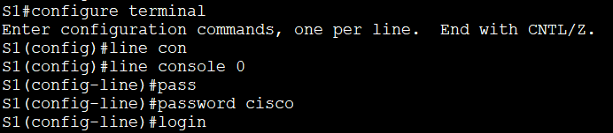

## Базовая настройка коммутатора
### Задание:
#### Часть 1. Проверка конфигурации коммутатора по умолчанию
#### Часть 2. Создание сети и настройка основных параметров устройства
* Настроить базовые параметры коммутатора  
* Настроить IP-адрес для ПК
#### Часть 3. Проверка сетевых подключений
* Отобразить конфигурацию устройства
* Протестировать сквозное соединение, отправив эхо-запрос
* Протестируйте возможности удаленного управления с помощью Telnet           

## Часть 1. Создание сети и проверка настроек коммутатора по умолчанию.

### Шаг 1. Создание сети согласно топологии
а. Подсоединить консольный кабель, как показано в топологии.  
             
b. Установите консольное подключение к коммутатору с компьютера PC-A с помощью программы эмуляции терминала 
 
## Контрольные вопросы:
1. Почему нужно использовать консольное подключение для первоначальной настройки коммутатора?  
Консоль предоставляет прямой доступ к интерфейсу конфигурации коммутатора, независимо от состояния сети.
2. Почему нельзя подключиться к коммутатору через Telnet или SSH?   
   Необходимо на коммутаторе настроить IP-адресацию.

### Шаг 2. Проверка настроек коммутатора по умолчанию.
a. Вводим команду **enable**, чтобы войти в привелигированный режим.   
&nbsp;&nbsp;&nbsp;&nbsp;Вводим команду **show rinning-config**, чтобы убедиться, что на коммутаторе находится пустой файл конфигурации.     
b. Изучить текущий файл **running configuration**        
&nbsp;&nbsp;&nbsp;&nbsp;- Сколько интерфейсов FastEthernet имеется на коммутаторе 2960?     
&nbsp;&nbsp;&nbsp;&nbsp; Ответ: 24 интерфейса.    
&nbsp;&nbsp;&nbsp;&nbsp; - Сколько интерфейсов Gigabit Ethernet имеется на коммутаторе 2960?            
&nbsp;&nbsp;&nbsp;&nbsp; Ответ: 2 интерфейса.      
&nbsp;&nbsp;&nbsp;&nbsp; - Каков диапазон значений, отображаемых в vty-линиях?   
&nbsp;&nbsp;&nbsp;&nbsp; Ответ: от 0 до 16         
c.Изучите файл загрузочной конфигурации (startup configuration), который содержится в энергонезависимом ОЗУ (NVRAM).   
      
&nbsp;&nbsp;&nbsp;&nbsp; - Почему появляется это сообщение?       
&nbsp;&nbsp;&nbsp;&nbsp; Ответ: Потому, что никто ещё не делал запись конфига.         
d. Изучите характеристики SVI для VLAN 1.           
&nbsp;&nbsp;&nbsp;&nbsp; - Назначен ли IP-адрес сети VLAN 1?          
&nbsp;&nbsp;&nbsp;&nbsp; Ответ: нет, не назначен.     
&nbsp;&nbsp;&nbsp;&nbsp; - Какой MAC-адрес имеет SVI?       
&nbsp;&nbsp;&nbsp;&nbsp;Ответ: MAC-адрес виртуального интерфейса коммутатора (SVI) может быть разным и зависит от конкретной конфигурации.      
&nbsp;&nbsp;&nbsp;&nbsp;В данном случае MAC адрес 0002.4aba.8703
                
&nbsp;&nbsp;&nbsp;&nbsp; - Данный интерфейс включен?        
&nbsp;&nbsp;&nbsp;&nbsp; Ответ: Данный интрефейс выключен.      
     
e.Изучить IP-свойства интерфейса SVI сети VLAN 1.      
 &nbsp;&nbsp;&nbsp;&nbsp;- Какие выходные данные вы видите?                 
                
&nbsp;&nbsp;&nbsp;&nbsp;в VLAN 1 не назначен порт, который находится в рабочем состоянии            
f. Подсоедините кабель Ethernet компьютера PC-A к порту 6 на коммутаторе и изучите IP-свойства интерфейса SVI сети VLAN 1. Дождитесь согласования параметров скорости и дуплекса между коммутатором и ПК.

g. Изучить сведения о версии ОС Cisco IOS на коммутаторе.    
&nbsp;&nbsp;&nbsp;&nbsp;Под управлением какой версии ОС Cisco IOS работает коммутатор?
            
&nbsp;&nbsp;&nbsp;&nbsp;Как называется файл образа системы?      
     
h.	Изучите свойства по умолчанию интерфейса FastEthernet, который используется компьютером PC-A.    
     
&nbsp;&nbsp;&nbsp;&nbsp;Интерфейс включен или выключен?      
&nbsp;&nbsp;&nbsp;&nbsp;Интерфейс включен.   
&nbsp;&nbsp;&nbsp;&nbsp;Что нужно сделать, чтобы включить интерфейс?        
&nbsp;&nbsp;&nbsp;&nbsp;Нужно выполнить команду **no shutdown**      
&nbsp;&nbsp;&nbsp;&nbsp;Какой MAC-адрес у интерфейса?     
    
&nbsp;&nbsp;&nbsp;&nbsp;Какие настройки скорости и дуплекса заданы в интерфейсе?     
    
&nbsp;&nbsp;&nbsp;&nbsp;i. Изучите флеш-память.        
&nbsp;&nbsp;&nbsp;&nbsp; Выпонить команду **show flash** либо **dir flash**      
       

## Часть 2. Настройка базовых параметров сетевых устройств

### Шаг 1. Настройка базовых параметров коммутатора         
a. В режиме глобальной конфигурации настроить базовые параметры конфигурации     
    

b. 	Назначьте IP-адрес интерфейсу SVI на коммутаторе.         
   

c. 	Доступ через порт консоли также следует ограничить  с помощью пароля.    
         

d. Настройте каналы виртуального соединения для удаленного управления (vty), чтобы коммутатор разрешил доступ через Telnet.         
        

&nbsp;&nbsp;&nbsp;&nbsp;Для чего нужна команда **login**?      
&nbsp;&nbsp;&nbsp;&nbsp;Чтобы ввести пароль в действие.    

### Шаг 2. Настройка IP-адреса на компьютере PC-A.       
      

## Часть 3. Проверка сетевых подключений      

### Шаг 1. Отобразите конфигурацию коммутатора     

a. Конфигурация приведена ниже.     
S1#show run         
S1#show running-config      
Building configuration...      

Current configuration : 1270 bytes     
!    
version 15.0     
no service timestamps log datetime msec     
no service timestamps debug datetime msec     
service password-encryption     
!     
hostname S1     
!     
enable secret 5 $1$mERr$9cTjUIEqNGurQiFU.ZeCi1    
!     
!     
no ip domain-lookup     
!     
!     
!     
spanning-tree mode pvst     
spanning-tree extend system-id     
!
interface FastEthernet0/1     
!
interface FastEthernet0/2     
!
interface FastEthernet0/3      
!
interface FastEthernet0/4     
!
interface FastEthernet0/5     
!    
interface FastEthernet0/6         
!
interface FastEthernet0/7         
!
interface FastEthernet0/8    
!
interface FastEthernet0/9   
!
interface FastEthernet0/10     
!
interface FastEthernet0/11    
!
interface FastEthernet0/12     
!
interface FastEthernet0/13     
!
interface FastEthernet0/14     
!
interface FastEthernet0/15     
!
interface FastEthernet0/16     
!
interface FastEthernet0/17     
!
interface FastEthernet0/18    
!
interface FastEthernet0/19     
!
interface FastEthernet0/20     
!
interface FastEthernet0/21     
!
interface FastEthernet0/22     
!
interface FastEthernet0/23     
!
interface FastEthernet0/24     
!
interface GigabitEthernet0/1    
!
interface GigabitEthernet0/2     
!       
interface Vlan1      
 ip address 192.168.1.2 255.255.255.0     
!
banner motd ^CUnauthorized access is strictly prohibited.^C     
!     
!      
!     
line con 0      
 password 7 0822455D0A16      
 login      
!      
line vty 0 4     
 password 7 0822455D0A16      
 login       
line vty 5 15      
 login      
!     
!     
!     
!      
end       

b. Проверить параметры VLAN 1.       
      

&nbsp;&nbsp;&nbsp;&nbsp;Какова полоса пропускания этого интерфейса?      
&nbsp;&nbsp;&nbsp;&nbsp;100000 Kbit/s

### Шаг 2. Протестируйте сквозное соединение, отправив эхо-запрос     
a. В командной строке компьютера PC-A с помощью утилиты ping проверьте связь сначала с адресом PC-A.     
      
