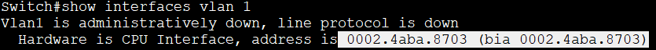

## Базовая настройка коммутатора
### Задание:
#### Часть 1. Проверка конфигурации коммутатора по умолчанию
#### Часть 2. Создание сети и настройка основных параметров устройства
* Настроить базовые параметры коммутатора  
* Настроить IP-адрес для ПК
#### Часть 3. Проверка сетевых подключений
* Отобразить конфигурацию устройства
* Протестировать сквозное соединение, отправив эхо-запрос
* Протестируйте возможности удаленного управления с помощью Telnet

## Решение:
### Шаг 1. Создание сети согласно топологии
а. Подсоединить консольный кабель, как показано в топологии.  
             
b. Установите консольное подключение к коммутатору с компьютера PC-A с помощью программы эмуляции терминала 
 
## Контрольные вопросы:
1. Почему нужно использовать консольное подключение для первоначальной настройки коммутатора?  
Консоль предоставляет прямой доступ к интерфейсу конфигурации коммутатора, независимо от состояния сети.
2. Почему нельзя подключиться к коммутатору через Telnet или SSH?   
   Необходимо на коммутаторе настроить IP-адресацию.

### Шаг 2. Проверка настроек коммутатора по умолчанию.
a. Вводим команду **enable**, чтобы войти в привелигированный режим.   
&nbsp;&nbsp;&nbsp;&nbsp;Вводим команду **show rinning-config**, чтобы убедиться, что на коммутаторе находится пустой файл конфигурации.     
b. Изучить текущий файл **running configuration**        
&nbsp;&nbsp;&nbsp;&nbsp;- Сколько интерфейсов FastEthernet имеется на коммутаторе 2960?     
&nbsp;&nbsp;&nbsp;&nbsp; Ответ: 24 интерфейса.    
&nbsp;&nbsp;&nbsp;&nbsp; - Сколько интерфейсов Gigabit Ethernet имеется на коммутаторе 2960?            
&nbsp;&nbsp;&nbsp;&nbsp; Ответ: 2 интерфейса.      
&nbsp;&nbsp;&nbsp;&nbsp; - Каков диапазон значений, отображаемых в vty-линиях?   
&nbsp;&nbsp;&nbsp;&nbsp; Ответ: от 0 до 16         
c.Изучите файл загрузочной конфигурации (startup configuration), который содержится в энергонезависимом ОЗУ (NVRAM).   
      
&nbsp;&nbsp;&nbsp;&nbsp; - Почему появляется это сообщение?       
&nbsp;&nbsp;&nbsp;&nbsp; Ответ: Потому, что никто ещё не делал запись конфига.         
d. Изучите характеристики SVI для VLAN 1.           
&nbsp;&nbsp;&nbsp;&nbsp; - Назначен ли IP-адрес сети VLAN 1?          
&nbsp;&nbsp;&nbsp;&nbsp; Ответ: нет, не назначен.     
&nbsp;&nbsp;&nbsp;&nbsp; - Какой MAC-адрес имеет SVI?       
&nbsp;&nbsp;&nbsp;&nbsp;Ответ: MAC-адрес виртуального интерфейса коммутатора (SVI) может быть разным и зависит от конкретной конфигурации.      
&nbsp;&nbsp;&nbsp;&nbsp;В данном случае MAC адрес 0002.4aba.8703
                
&nbsp;&nbsp;&nbsp;&nbsp; - Данный интерфейс включен?        
&nbsp;&nbsp;&nbsp;&nbsp; Ответ: Данный интрефейс выключен.      
     
e.Изучить IP-свойства интерфейса SVI сети VLAN 1.      
 &nbsp;&nbsp;&nbsp;&nbsp;- Какие выходные данные вы видите?                 
                
&nbsp;&nbsp;&nbsp;&nbsp;в VLAN 1 не назначен порт, который находится в рабочем состоянии            
f. Подсоедините кабель Ethernet компьютера PC-A к порту 6 на коммутаторе и изучите IP-свойства интерфейса SVI сети VLAN 1. Дождитесь согласования параметров скорости и дуплекса между коммутатором и ПК.

g. Изучить сведения о версии ОС Cisco IOS на коммутаторе.    
&nbsp;&nbsp;&nbsp;&nbsp;Под управлением какой версии ОС Cisco IOS работает коммутатор?
            
&nbsp;&nbsp;&nbsp;&nbsp;Как называется файл образа системы?      
