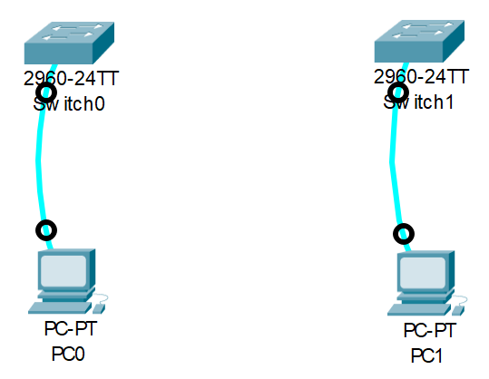
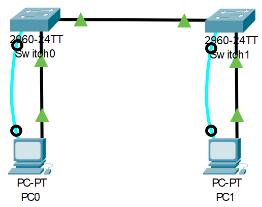
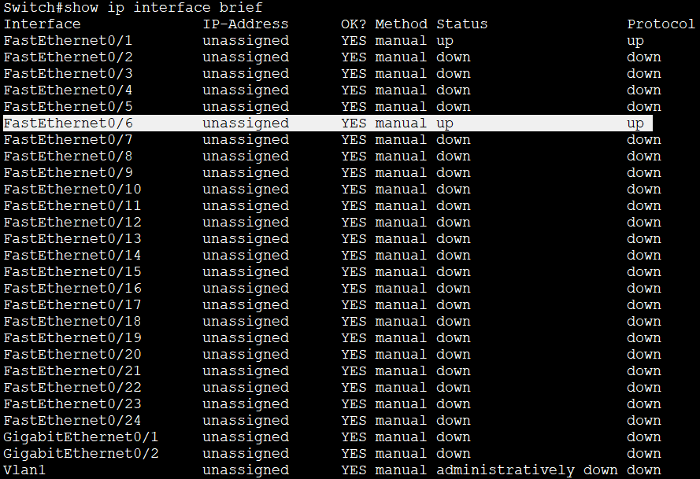
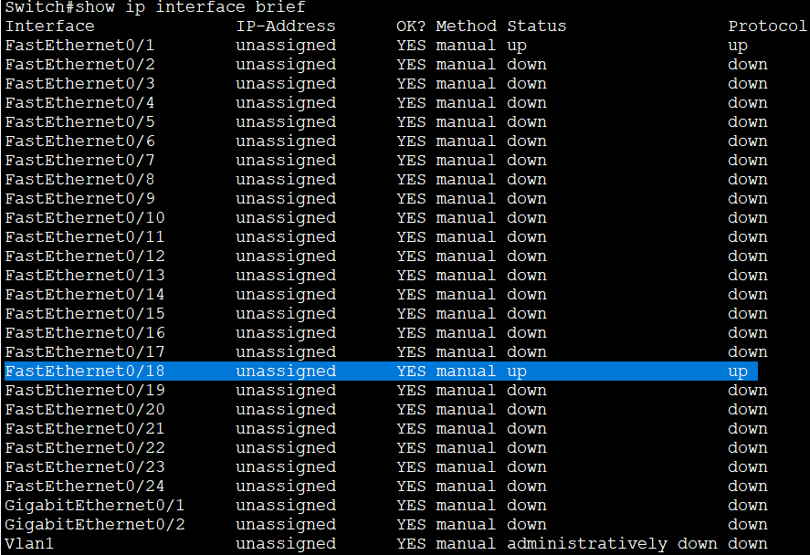
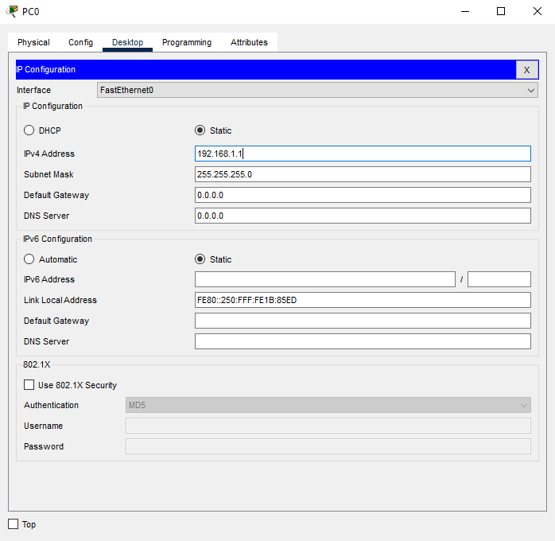
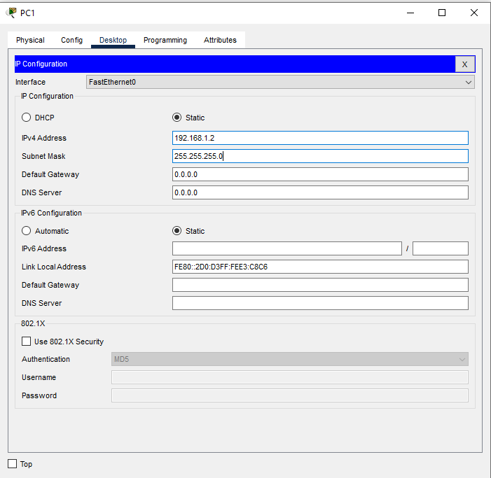
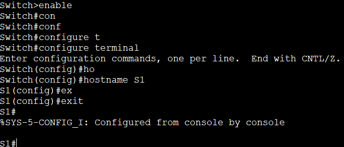

##   Лабораторная работа. Просмотр таблицы MAC-адресов коммутатора
### Задание:     
#### Часть 1. Создание и настройка сети    
#### Часть 2. Изучение таблицы МАС-адресов коммутатора     
##  Часть 1. Часть 1. Создание и настройка сети    
### Шаг 1. Подключить сеть в соответствии с топологией.    
&nbsp;&nbsp;&nbsp;&nbsp; Подключаем консольный кабель    
    
&nbsp;&nbsp;&nbsp;&nbsp;Присоединяем кабель Ethernet к устройствам         
   
&nbsp;&nbsp;&nbsp;&nbsp;Проверяем включены ли интерфейсы на коммутаторах     
    

       

### Шаг 2. Настройка узлов ПК      
&nbsp;&nbsp;&nbsp;&nbsp;Настраиваем IP-адреса на ПК   
        

       

### Шаг 3. Выполнить инициализацию и перезагрузку коммутаторов          
&nbsp;&nbsp;&nbsp;На коммутаторе 1 вводим последовательно команды:        
&nbsp;&nbsp;&nbsp;**enable** - вход в привелиигированный режим;       
&nbsp;&nbsp;&nbsp;**copy running-config startup-config** - сохраняет текущую конфигурацию                
&nbsp;&nbsp;&nbsp; **erase startup-config** - удаляет текущую конфигурацию, сохраненную в энергозависимой памяти (NVRAM);        
&nbsp;&nbsp;&nbsp;**reload** - Коммутатор начнет процесс перезагрузки.         
&nbsp;&nbsp;&nbsp; Повторяем процедуру для коммутатора 2      

### Шаг 4 Настройка базовых парамеиров каждого коммутатора       
&nbsp;&nbsp;&nbsp;&nbsp;a. Настройте имена устройств в соответствии с топологией.     
      

       
