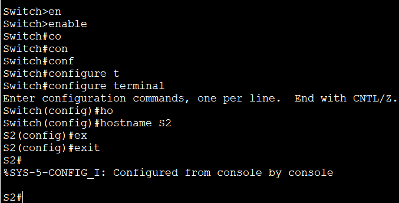
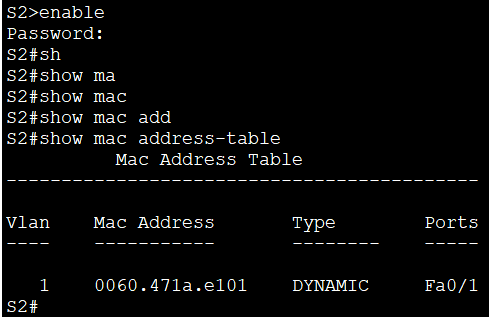

##   Лабораторная работа. Просмотр таблицы MAC-адресов коммутатора
### Задание:     
#### Часть 1. Создание и настройка сети    
#### Часть 2. Изучение таблицы МАС-адресов коммутатора     
##  Часть 1. Часть 1. Создание и настройка сети    
### Шаг 1. Подключить сеть в соответствии с топологией.    
&nbsp;&nbsp;&nbsp;&nbsp; Подключаем консольный кабель    
    
&nbsp;&nbsp;&nbsp;&nbsp;Присоединяем кабель Ethernet к устройствам         
   
&nbsp;&nbsp;&nbsp;&nbsp;Проверяем включены ли интерфейсы на коммутаторах     
    

       

### Шаг 2. Настройка узлов ПК      
&nbsp;&nbsp;&nbsp;&nbsp;Настраиваем IP-адреса на ПК   
        

       

### Шаг 3. Выполнить инициализацию и перезагрузку коммутаторов          
&nbsp;&nbsp;&nbsp;На коммутаторе 1 вводим последовательно команды:        
&nbsp;&nbsp;&nbsp;**enable** - вход в привелиигированный режим;       
&nbsp;&nbsp;&nbsp;**copy running-config startup-config** - сохраняет текущую конфигурацию                
&nbsp;&nbsp;&nbsp; **erase startup-config** - удаляет текущую конфигурацию, сохраненную в энергозависимой памяти (NVRAM);        
&nbsp;&nbsp;&nbsp;**reload** - Коммутатор начнет процесс перезагрузки.         
&nbsp;&nbsp;&nbsp; Повторяем процедуру для коммутатора 2      

### Шаг 4 Настройка базовых парамеиров каждого коммутатора       
&nbsp;&nbsp;&nbsp;&nbsp;a. Настройте имена устройств в соответствии с топологией.     
      

       

&nbsp;&nbsp;&nbsp;b. Настройте IP-адреса, как указано в таблице адресации       
         

       

&nbsp;&nbsp;&nbsp;c. Назначьте cisco в качестве паролей консоли и VTY.     
          

        

         

       

&nbsp;&nbsp;&nbsp;d. Назначьте class в качестве пароля доступа к привилегированному режиму EXEC.

         

      

&nbsp;&nbsp;&nbsp;Сохраняем параметры конфигурации       
          

    

## Часть 2. Изучение таблицы МАС-адресов коммутатора.      

### Шаг 1. Запишите МАС-адреса сетевых устройств          
&nbsp;&nbsp;&nbsp;a	Откройте командную строку на PC-A и PC-B и введите команду **ipconfig /all**.
        

         

&nbsp;&nbsp;&nbsp;Назовите физические адреса адаптера Ethernet.      
&nbsp;&nbsp;&nbsp;MAC-адрес компьютера PC-A: 00E0.F955.C182     
&nbsp;&nbsp;&nbsp;MAC-адрес компьютера PC-B: 0002.16A3.80EA      

&nbsp;&nbsp;&nbsp;b.Подключитесь к коммутаторам S1 и S2 через консоль и введите команду **show interface F0/1** на каждом коммутаторе.         
          

         

&nbsp;&nbsp;&nbsp;Назовите адреса оборудования во второй строке выходных данных команды (или зашитый адрес — bia).        
&nbsp;&nbsp;&nbsp;МАС-адрес коммутатора S1 Fast Ethernet 0/1:   0060.471a.e101 (bia 0060.471a.e101)            

&nbsp;&nbsp;&nbsp;МАС-адрес коммутатора S2 Fast Ethernet 0/1:   00e0.8f42.1601 (bia 00e0.8f42.1601)       

### Шаг 2. Просмотрите таблицу МАС-адресов коммутатора      
&nbsp;&nbsp;&nbsp;a.Подключитесь к коммутатору S2 через консоль и войдите в привилегированный режим EXEC.           
         

&nbsp;&nbsp;&nbsp;b.В привилегированном режиме EXEC введите команду **show mac address-table** и нажмите клавишу ввода.        
                            

&nbsp;&nbsp;&nbsp;Записаны ли в таблице МАС-адресов какие-либо МАС-адреса?          
&nbsp;&nbsp;&nbsp;Да, записаны.       
&nbsp;&nbsp;&nbsp;Какие МАС-адреса записаны в таблице? С какими портами коммутатора они сопоставлены и каким устройствам принадлежат? Игнорируйте МАС-адреса, сопоставленные с центральным процессором.       
&nbsp;&nbsp;&nbsp;  В Vlan 1 имеется MAC-адрес интерфейса Fa0/1.      
&nbsp;&nbsp;&nbsp;Если вы не записали МАС-адреса сетевых устройств в шаге 1, как можно определить, каким устройствам принадлежат МАС-адреса, используя только выходные данные команды **show mac address-table**? Работает ли это решение в любой ситуации?        
&nbsp;&nbsp;&nbsp; В столбце «Ports» отображается интерфейс с этим MAC-адресом.

### Шаг 3. Очистите таблицу МАС-адресов коммутатора S2 и снова отобразите таблицу МАС-адресов.        
&nbsp;&nbsp;&nbsp;a.В привилегированном режиме EXEC введите команду **clear mac address-table dynamic** и нажмите клавишу Enter.        
       

&nbsp;&nbsp;&nbsp;b. Снова быстро введите команду **show mac address-table**.       
             

&nbsp;&nbsp;&nbsp;Указаны ли в таблице МАС-адресов адреса для VLAN 1? Указаны ли другие МАС-адреса? Нет, не указаны. Он пустой. 

&nbsp;&nbsp;&nbsp; Через 10 секунд введите команду **show mac address-table** и нажмите клавишу ввода. Появились ли в таблице МАС-адресов новые адреса?          
         
&nbsp;&nbsp;&nbsp;Снова отображается старый MAC-адрес.     

### Шаг 4. С компьютера PC-B отправьте эхо-запросы устройствам в сети и просмотрите таблицу МАС-адресов коммутатора.         

&nbsp;&nbsp;&nbsp; a.На компьютере PC-B откройте командную строку и еще раз введите команду arp -a.         
                

&nbsp;&nbsp;&nbsp;Не считая адресов многоадресной и широковещательной рассылки, сколько пар IP- и МАС-адресов устройств было получено через протокол ARP?        
&nbsp;&nbsp;&nbsp;3 пары: для каждого устройства в сети без PC-B.           

&nbsp;&nbsp;&nbsp; b.	Из командной строки PC-B отправьте эхо-запросы на компьютер PC-A, а также коммутаторы S1 и S2.         
    
&nbsp;&nbsp;&nbsp;От всех ли устройств получены ответы? Если нет, проверьте кабели и IP-конфигурации.      
&nbsp;&nbsp;&nbsp; Да. От всех устройств получены ответы.         

&nbsp;&nbsp;&nbsp;c.	Подключившись через консоль к коммутатору S2, введите команду show mac address-table.        
      

&nbsp;&nbsp;&nbsp;Добавил ли коммутатор в таблицу МАС-адресов дополнительные МАС-адреса? Если да, то какие адреса и устройства?      
&nbsp;&nbsp;&nbsp; На коммутаторе S1 имеются MAC-адреса обоих ПК и интерфейсов Fa0/1 и Vlan1.         

&nbsp;&nbsp;&nbsp;На компьютере PC-B откройте командную строку и еще раз введите команду **arp -a**.       
     

&nbsp;&nbsp;&nbsp;Появились ли в ARP-кэше компьютера PC-B дополнительные записи для всех сетевых устройств, которым были отправлены эхо-запросы?      
&nbsp;&nbsp;&nbsp;Указаны IP и MAC адреса всех устройств в сети.         

## 	Вопрос для повторения    
&nbsp;&nbsp;&nbsp;В сетях Ethernet данные передаются на устройства по соответствующим МАС-адресам. Для этого коммутаторы и компьютеры динамически создают ARP-кэш и таблицы МАС-адресов. Если компьютеров в сети немного, эта процедура выглядит достаточно простой. Какие сложности могут возникнуть в крупных сетях?        
&nbsp;&nbsp;&nbsp;Слишком большое количество ARP-запросов может замедлить работу всей сети.  